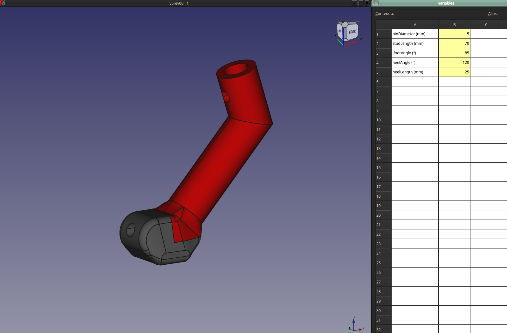
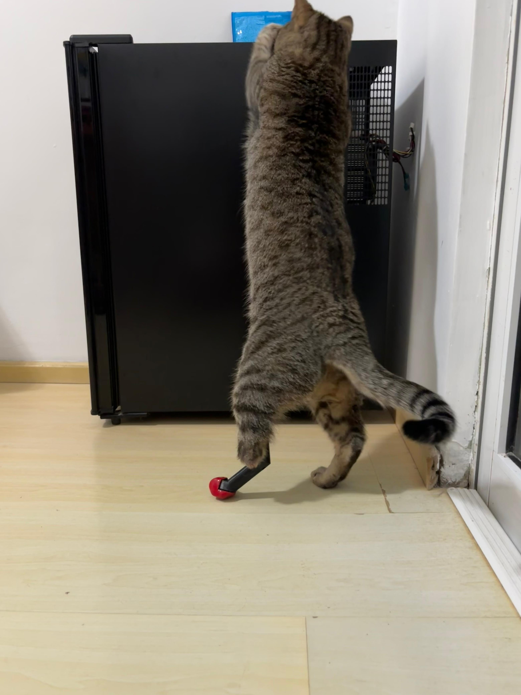
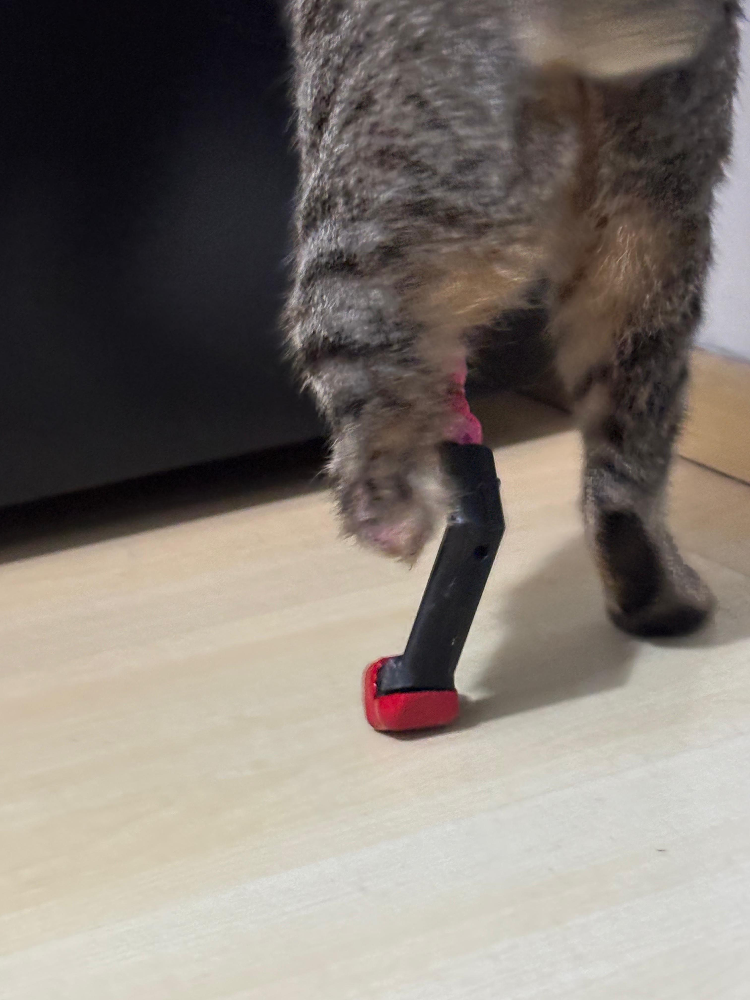

# Parametric prosthetic foot for Cats designed in FreeCAD

Developed in partnership with Dr. Itallo Freitas

## Altering dimensions

To alter the dimensions use the `variables` spreadsheet within FreeCAD

## Parts 

- Foot

  Printed in flexible PLA and coated with cold rubber (coated 4 times)

- Stud

  Printed in PETG. Needs an M3 heat insert for securing foot and a extrusion gear from 3D printer is used as a bushing to attach to the implant.

## Results

.jpg)

